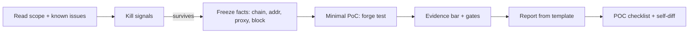

# Web3 Bounty: PoC and Report Protocol

This skill packages a **submission pipeline**: kill weak ideas early, lock facts, ship a minimal PoC, then expand the narrative. It does **not** replace a program’s official rules—on conflict, follow the **project’s official scope and severity matrix**.

## How peers structure similar skills (for maintainers)

Open repos in this space usually combine:

| Pattern | Example repos | What to copy (legally: ideas, not prose) |
|--------|----------------|----------------------------------------|
| **Huge trigger lists** in `description` | [mariano-aguero/solidity-security-audit-skill](https://github.com/mariano-aguero/solidity-security-audit-skill) (`SKILL.md` + `references/`) | Many keywords so the agent auto-selects the skill; keep yours shorter to save tokens unless you fork their repo. |
| **Orchestrated phases + bundles** | [sanbir/solidity-auditor-skills](https://github.com/sanbir/solidity-auditor-skills) (`solidity-auditor/SKILL.md`) | Explicit turns: discover → prepare → validate → report; heavy content stays in `references/`. |
| **“Kill weak findings” + gates before writing** | [fr3akhacks/claude-bug-bounty](https://github.com/fr3akhacks/claude-bug-bounty) (`SKILL.md`) | Tables of discard patterns; a single north-star question; validation gates. |
| **Monolith `SKILL.md`** | [fr3akhacks/claude-bug-bounty](https://github.com/fr3akhacks/claude-bug-bounty), [mariano-aguero/solidity-security-audit-skill](https://github.com/mariano-aguero/solidity-security-audit-skill) | Everything inline—powerful but expensive in context; this skill stays **thin main file + references**. |

This folder follows the **thin orchestrator + references** style so it stays usable inside normal agent context windows.

---

## The north-star question (Web3)

> **After state setup that the program considers fair game, can an attacker with the claimed role move value, seize authorization, or permanently freeze third-party funds on-chain—and did you demonstrate it in code or trace-backed steps?**

- If the honest answer is **no** or “only with extra off-chain collusion you did not model,” **stop** before writing a long report. Capture a short LEAD note instead.

Full discard patterns: [references/WEB3-KILL-SIGNALS.md](references/WEB3-KILL-SIGNALS.md).

---

## Context gate (ask once if missing)

If the user jumps straight to “write my Immunefi report” without facts, ask the questions in [references/CONTEXT-BEFORE-DRAFT.md](references/CONTEXT-BEFORE-DRAFT.md) **in one message** (numbered list). If they refuse, apply the documented defaults and **state them explicitly** at the top of the draft.

---

## Pipeline (mermaid)



---

## Hard rules (agent must follow)

1. **Never** commit mnemonics, private keys, session cookies, or production API secrets—environment placeholders only (`MAINNET_RPC_URL`, etc.).
2. **Identity bundle** before conclusions: `chainId`, contract addresses, proxy pattern (if any), implementation vs proxy user entry, and **pinned fork block** when relevant.
3. **Scope & duplicates**: cite in-scope category vs program text; explain why not a known issue/design doc; if uncertain, list questions—not claims.
4. **Reproducibility**: `git clone` + install + documented command(s); pin tool versions in README.
5. **Honest severity**: separate *speculative* / *privileged* / *permissionless on-chain* / *economic net positive*; align language with [references/SEVERITY-RUBRIC.md](references/SEVERITY-RUBRIC.md) and the program’s own matrix.

---

## Phase A — Triage and scope

- Read **scope, out-of-scope, known issues, rewards, severity definitions** from the program page the user provides.
- Map the finding to the program’s **impact categories** (do not invent labels).
- For governance, multisig, oracle, or off-chain keeper assumptions, label **attacker model** and **trust boundaries**.

## Phase B — PoC (Foundry default)

1. Minimal `foundry.toml`; pin Solidity + `forge-std` (document in README).
2. Fork: user-supplied RPC + **pinned `block.number`** in README.
3. Tests named `test_reproduce_*`; assertions encode the bug (not `console.log` alone).
4. Skeleton: [references/FOUNDRY-POC-SKELETON.md](references/FOUNDRY-POC-SKELETON.md).
5. If reproduction is partial, add **Limitations** with the closest automated path.

**Hardhat:** match existing scripts; document Node version + fork `blockNumber`.

## Phase C — Evidence and gates

- Evidence expectations: [references/EVIDENCE-BAR.md](references/EVIDENCE-BAR.md).
- Run the **five gates** in [references/TRIAGE-GATES.md](references/TRIAGE-GATES.md) before treating the write-up as submit-ready.

## Phase D — Written report

- Sections: [references/REPORT-TEMPLATE.md](references/REPORT-TEMPLATE.md).
- PoC hygiene: [references/POC-CHECKLIST.md](references/POC-CHECKLIST.md).

## Report tone

- **Executive summary**: 4–8 sentences; impact, prerequisites, why it matters on-chain.
- **Technical body**: permalinks or `path:line` references; optional mermaid for fund/control flow.
- **Remediation**: name the call path and state transitions, not generic buzzwords.

---

## Master checklist (copy into the thread)

```
Bounty workflow progress:
- [ ] Scope: program rules + known issues ingested
- [ ] Kill signals: passed WEB3-KILL-SIGNALS.md
- [ ] Facts: chainId, addresses, proxy, pinned block
- [ ] Evidence bar met (see EVIDENCE-BAR.md)
- [ ] Gates: TRIAGE-GATES.md (all five)
- [ ] PoC: minimal forge test + README pins
- [ ] Report: REPORT-TEMPLATE.md filled
- [ ] Self-check: POC-CHECKLIST.md
```

---

## For humans: installing this skill

**From the published GitHub repository**

1. Copy `skills/web3-bounty-poc-report/` to your app repo as `.cursor/skills/web3-bounty-poc-report/` (create `.cursor/skills` if needed).
2. Or from this monorepo root run: `./skill.sh install /path/to/target/project` (Bash: Git for Windows, WSL, macOS, or Linux).
3. Reload the Cursor window so skills are discovered.

**In Cursor**

- Manual invoke: `/` → search `web3-bounty-poc-report`.
- Optional: Settings → Rules → Remote Rule, if you publish a standalone skills repo and your Cursor version supports it.

**Examples in this repository**

- Redacted report walkthrough: `examples/sample-report-redacted.md`
- Short LEAD (downgraded) note: `examples/sample-lead-note.md`
- Forge log excerpt style: `examples/sample-forge-run-excerpt.md`

See root `README.md` for layout and `research/SOURCES.md` for external methodology links.

---

## Conventions (summary)

| Practice | Why |
|----------|-----|
| One folder per skill | `name` matches folder |
| Orchestrator + `references/` | Tokens stay small; depth loads on demand |
| Kill tables + gates | Stops “essay-only” submissions |
| Pinned fork + addresses | Reviewers reproduce without guesswork |
